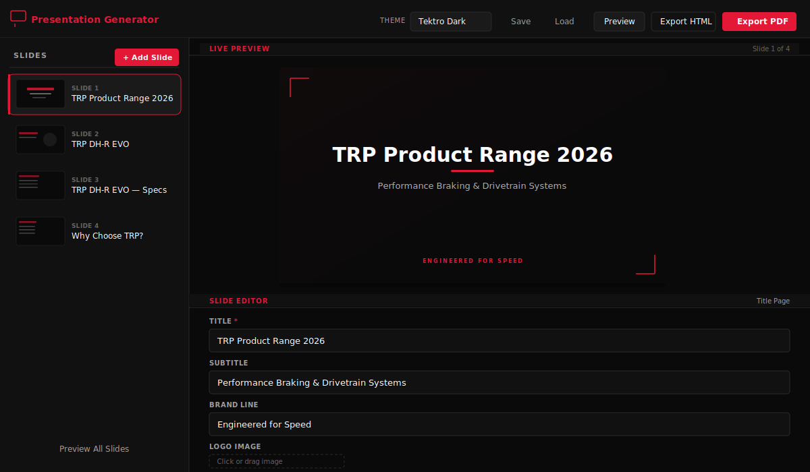
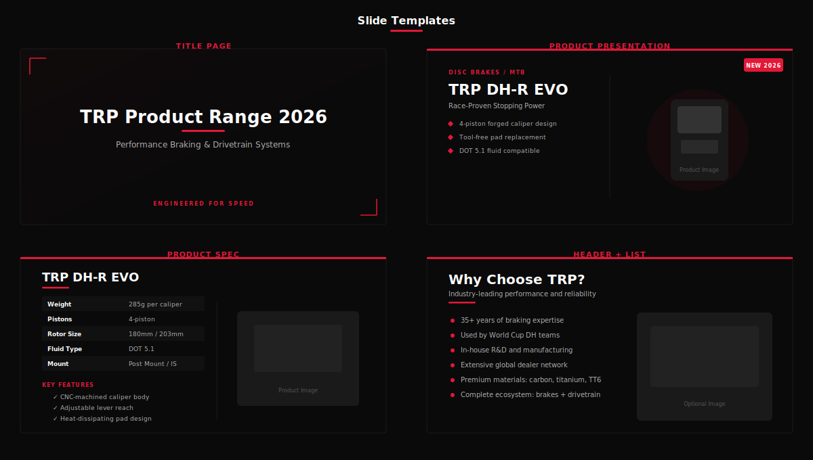
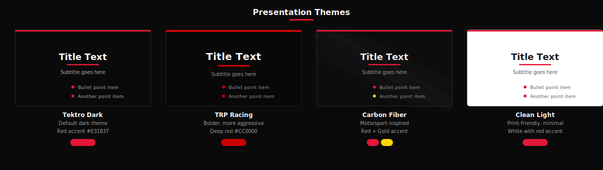
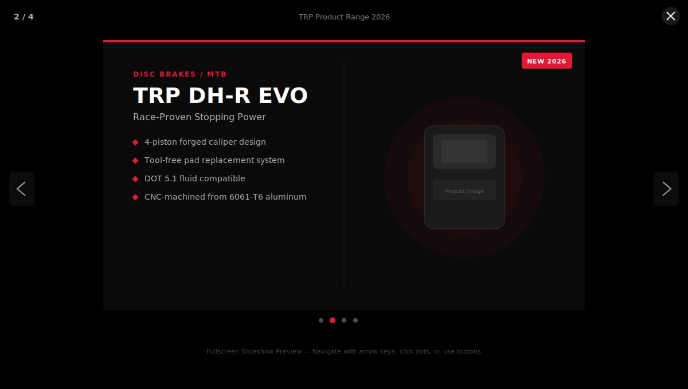

# Sales Presentation Generator

A web-based tool for creating professional sales presentations for **TEKTRO** and **TRP Cycling** components. Built for product managers and sales teams who need to quickly assemble stunning, on-brand slide decks without design tools.

> **Zero dependencies.** Just open `index.html` in a browser and start building.

---

## Builder Interface

The builder uses a three-panel layout: a slide list sidebar, a live preview, and a content editor with template-specific form fields.



- **Left sidebar** — slide list with thumbnails, drag-and-drop reordering, and up/down/delete controls
- **Top area** — live 16:9 preview that updates in real-time as you type
- **Bottom area** — dynamic form editor that adapts to the selected slide template

---

## Slide Templates

Six professionally designed templates cover common sales presentation needs.



| Template | Purpose | Key Fields |
|----------|---------|------------|
| **Title Page** | Opening brand statement | Title, subtitle, brand line, logo, background image |
| **Product Presentation** | Hero product showcase | Product name, tagline, selling points, product image, badge |
| **Product Gallery** | Multi-image showcase | Heading, up to 3 images with captions, layout (3-col / 1+2 / 2-col) |
| **Product Spec** | Technical details | Product name, specs table (key-value), features list, image |
| **Header + List** | Flexible content slide | Heading, subheading, bullet list, optional image, layout choice |
| **Data & Graph** | Charts and data visuals | Bar chart, XY line plot, or centered image + detail notes |

Each template renders with proper typography hierarchy, accent markers, and subtle decorative elements (corner brackets, divider lines, radial glows).

### Data & Graph Slide

The graph slide supports three display modes:

- **Bar Chart** — enter `label,value` per line (e.g., `Q1,120`). Renders a styled SVG bar chart with animated bars, grid lines, and value labels.
- **XY Line Plot** — same data format. Renders a line chart with area fill, data points, and grid. Labels are used as X-axis values.
- **Centered Image** — paste a screenshot (e.g., from Excel) and add detail notes in a sidebar.

All charts are rendered as inline SVG for crisp output at any resolution, including PDF export.

---

## Presentation Themes

Choose from four themes that apply globally across all slides.



| Theme | Style | Accent Color |
|-------|-------|--------------|
| **Tektro Dark** | Default premium dark | `#E31837` Red |
| **TRP Racing** | Bolder, heavier weights | `#CC0000` Deep Red |
| **Carbon Fiber** | Diagonal pattern overlay | `#E31837` Red + `#FFD700` Gold |
| **Clean Light** | White background, print-friendly | `#E31837` Red on white |

Themes are CSS-custom-property-driven — switching is instant and affects all slides.

---

## Fullscreen Slideshow Preview

Preview your entire presentation as a fullscreen slideshow with animated transitions.



- Navigate with **arrow keys**, **spacebar**, **dot indicators**, or **on-screen buttons**
- Each slide animates in with staggered fade/slide/scale effects
- Press **Escape** to close

---

## Features

### Slide Management
- **Add slides** from a template picker modal
- **Reorder** via drag-and-drop or up/down arrow buttons
- **Delete** slides with confirmation
- **Select** any slide to edit and preview instantly

### Content Editing
- Text inputs for titles, subtitles, taglines
- **Dynamic list builder** — add/remove bullet points
- **Spec table editor** — add/remove key-value rows
- **Image upload** with drag-and-drop support (images are compressed client-side and stored as data URLs)
- Layout selector for the generic template (text-left, text-right, full-width, centered)

### Save & Load
- **Auto-saves** to `localStorage` every 2 seconds
- **Save as JSON** — download the full presentation as a `.json` file
- **Load JSON** — re-import a previously saved `.json` file
- **Load HTML** — re-import a previously exported `.html` presentation for further editing

### Export
- **Export PDF** — generates a high-quality landscape PDF via html2canvas + jsPDF. Each slide is rendered at 2x resolution.
- **Export HTML** — generates a self-contained, shareable HTML slideshow file. The HTML file:
  - Works standalone in any browser (no server needed)
  - Includes all CSS, fonts, and images inline
  - Has keyboard navigation (arrow keys, spacebar)
  - **Embeds the full presentation state** so it can be loaded back into the builder for editing

### Keyboard Shortcuts
| Shortcut | Action |
|----------|--------|
| `Ctrl+S` / `Cmd+S` | Save presentation as JSON file |
| `Escape` | Close any open modal or slideshow |
| `Arrow Left/Right` | Navigate slides in slideshow mode |
| `Spacebar` | Next slide in slideshow mode |

---

## Getting Started

### 1. Open the tool

```
Open presentation-generator/index.html in any modern browser
```

No server, no build step, no installation required.

### 2. Add your first slide

Click **+ Add Slide** in the sidebar and choose a template.

### 3. Fill in content

Type your content in the editor form. The live preview updates as you type. Upload product images by clicking the image drop zone or dragging a file onto it.

### 4. Choose a theme

Select a presentation theme from the dropdown in the header bar.

### 5. Preview

Click **Preview** to see the full slideshow with animations.

### 6. Export

- Click **Export PDF** for a shareable PDF file
- Click **Export HTML** for an interactive HTML slideshow (this can also be re-imported later for editing)
- Click **Save** to download the raw JSON data

---

## Re-editing an Exported Presentation

One of the key features is the ability to **re-import and edit** previously exported HTML presentations:

1. Click **Load** in the header
2. Choose option **2** (HTML presentation file)
3. Select the `.html` file you previously exported
4. The builder restores all slides, content, images, and theme settings
5. Make your edits and export again

This works because the exported HTML embeds the full presentation state as a hidden JSON payload inside a `<script type="application/json" id="presentation-data">` tag.

---

## Technical Details

### Architecture
- **Pure vanilla HTML/CSS/JavaScript** — no frameworks, no build tools, no npm
- Consistent with the existing Product 360 website's static approach
- All files are in the `/presentation-generator/` subfolder

### File Structure

```
presentation-generator/
├── index.html              # Builder web application
├── README.md               # This file
├── css/
│   ├── builder.css         # Builder UI styles (sidebar, forms, modals)
│   └── slides.css          # Slide rendering styles, themes, animations
├── js/
│   ├── templates.js        # 4 slide template definitions (fields + render)
│   ├── app.js              # Main controller (state, CRUD, forms, events)
│   ├── preview.js          # Live preview + fullscreen slideshow
│   └── export.js           # Save/load + PDF/HTML export
├── assets/
│   └── placeholder.svg     # Default image placeholder
└── docs/
    ├── screenshot-builder.svg
    ├── screenshot-templates.svg
    ├── screenshot-slideshow.svg
    └── screenshot-themes.svg
```

### External Dependencies (CDN)
- **Google Fonts** — Montserrat (headings) + Inter (body)
- **html2canvas** v1.4.1 — renders slides to canvas for PDF export
- **jsPDF** v2.5.1 — assembles canvas images into a PDF

### Browser Support
Modern browsers: Chrome, Firefox, Safari, Edge (latest versions). The tool uses CSS custom properties, CSS Grid, ES5+ JavaScript, HTML5 Drag and Drop API, and the FileReader API.

### Slide Dimensions
All slides render at **960 x 540px** (16:9 aspect ratio), scaled to fit the preview container and exported at 2x resolution for crisp PDFs.

---

## Brand Identity

The presentation themes follow the TEKTRO / TRP corporate identity:

- **Dark premium aesthetic** — black/near-black backgrounds
- **Red accent** — `#E31837` (Tektro red) as the primary brand color
- **Typography** — Montserrat (bold headings, weight 800) + Inter (clean body text)
- **Design language** — motorsport-inspired, large product imagery, clean geometric accents

---

## License

Internal tool for TEKTRO / TRP Cycling sales teams. Not for public distribution.
